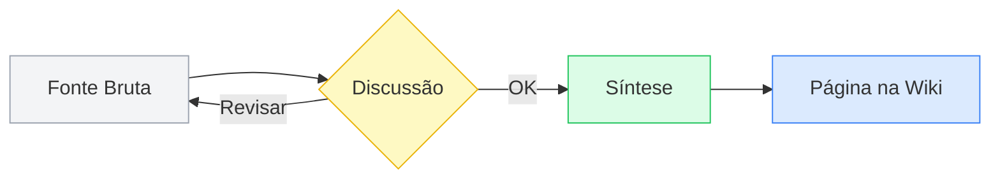

# Enriquecimento Visual

Use elementos visuais sempre que pertinente para comunicar ideias de forma mais clara que texto puro. Não enfeite por enfeite — cada elemento visual deve ter um propósito comunicativo.

## Elementos Permitidos

### Diagramas Mermaid

Use Mermaid para fluxos, hierarquias, arquiteturas, sequências e comparações estruturais.

**Tipos mais usados:**

- `flowchart` — fluxos de processo, algoritmos, pipelines
- `graph` — hierarquias, taxonomias, árvores de decisão
- `sequenceDiagram` — interação entre componentes ao longo do tempo
- `classDiagram` — estruturas de dados, relações entre entidades

### Tabelas

Use tabelas para comparações, definições multi-atributo, trade-offs, listas de critérios.

### Callouts do Obsidian

| Callout | Quando usar |
|---|---|
| `[!tip]` | Dica prática, atalho, boa prática |
| `[!note]` | Complemento, definição auxiliar, nota de contexto |
| `[!warning]` | Armadilha comum, algo fácil de errar |
| `[!example]` | Exemplo concreto de aplicação |
| `[!info]` | Informação adicional, curiosidade relevante |
| `[!quote]` | Citação marcante da fonte |

```markdown
> [!tip] Dica
> Atalho do teclado ou boa prática que economiza tempo.

> [!warning] Armadilha
> É comum esquecer de tratar esse caso de borda.
```

### Listas de Conexões com Callout de Páginas Futuras

```markdown
> [!note] Páginas futuras
> **Trade-off arquitetural** — a 1ª Lei desenvolve esse conceito. Criar
> página quando houver mais fontes (ex: Cap 4 do Fundamentos).
```

## Paleta de Cores Consistente (Paleta Minimalista TCC)

Cores pastel, baixo contraste — ideal para diagramas densos sem poluição visual. Funciona bem no tema Obsidian padrão (`theme: obsidian`).

### Cores de Fundo

| Uso | Cor | Código | Classe Mermaid |
|---|---|---|---|
| Conceito / Entidade central | Azul bebê | `#dbeafe` | `classDef concept fill:#dbeafe,stroke:#3b82f6` |
| Ação / Processo | Verde bebê | `#dcfce7` | `classDef action fill:#dcfce7,stroke:#22c55e` |
| Decisão / Condicional | Amarelo bebê | `#fef9c3` | `classDef decision fill:#fef9c3,stroke:#eab308` |
| Dado / Armazenamento | Cinza neutro | `#f3f4f6` | `classDef storage fill:#f3f4f6,stroke:#9ca3af` |
| Atenção / Crítico | Rosa bebê | `#fee2e2` | `classDef alert fill:#fee2e2,stroke:#ef4444` |

### Cores de Borda

| Uso | Código |
|---|---|
| Borda padrão (conceitos, dados) | `#3b82f6` |
| Borda de ação | `#22c55e` |
| Borda de decisão | `#eab308` |
| Borda crítica | `#ef4444` |
| Borda neutra (dado) | `#9ca3af` |

### Exemplo Completo



## Icons no Frontmatter (Icon Folder)

Use o campo `icon` no frontmatter para identificar visualmente o tipo de página no file explorer e no título:

```yaml
---
icon: 📘
type: concept
---
```

Sugestão de icons por tipo de página:

| Tipo | Icon |
|---|---|
| concept | `📘` |
| comparison | `⚖️` |
| query | `❓` |
| recipe | `🔧` |
| summary | `📝` |

## Diagramas Hand-drawn com Excalidraw

Para diagramas que o Mermaid não captura bem — arquiteturas complexas, mapas mentais, rabiscos conceituais:

- Crie arquivos `.excalidraw` ou cole desenhos como imagens PNG
- Use para: mapas de competências, visões gerais de tópicos, diagramas de arquitetura com muitos elementos
- Armazene em `config/attachments/` seguindo a convenção de nomenclatura

## Gráficos e Visualizações de Dados

Use o **Obsidian Charts** + **Dataview** para gerar gráficos a partir dos dados do frontmatter.

Exemplo: distribuição de páginas por `type`:

```dataviewjs
const data = dv.pages('"wiki"')
  .groupBy(p => p.type)
  .map(g => ({ key: g.key, count: g.rows.length }));

dv.span("```chart\ntype: bar\nlabels: [" + data.map(d => "'" + d.key + "'").join(",") + "]\nseries:\n  - title: Páginas\n    data: [" + data.map(d => d.count).join(",") + "]\n```");
```

Útil para visualizar:
- Cobertura por competência (quantas páginas por `competency`)
- Nível de entendimento (high / medium / low)
- Progresso de leitura

## Quadros Kanban para Planejamento de Estudos

Use o **Kanban** plugin para organizar visualmente temas de estudo:

```markdown
---

## A explorar

- [ ] [[topicos/event-sourcing|Event Sourcing]]
- [ ] [[topicos/cqrs|CQRS]]

## Estudando

- [ ] [[topicos/kubernetes-networking|Kubernetes Networking]]

## Consolidado

- [x] [[topicos/conascencia|Conascência]]
```

## O que evitar

- **Gradientes** — não funcionam bem em todos os temas do Obsidian
- **Mais de 3 cores vibrantes no mesmo diagrama** — polui visualmente
- **Diagramas puramente decorativos** — todo diagrama deve comunicar algo que texto puro comunicaria pior
- **Callouts sem conteúdo substancial** — um `[!tip]` vazio é pior que nenhum callout
- **Excalidraw para diagramas simples** — se Mermaid resolve em 3 linhas, use Mermaid
- **Gráficos sem legenda ou eixos claros** — o leitor precisa entender sem esforço
