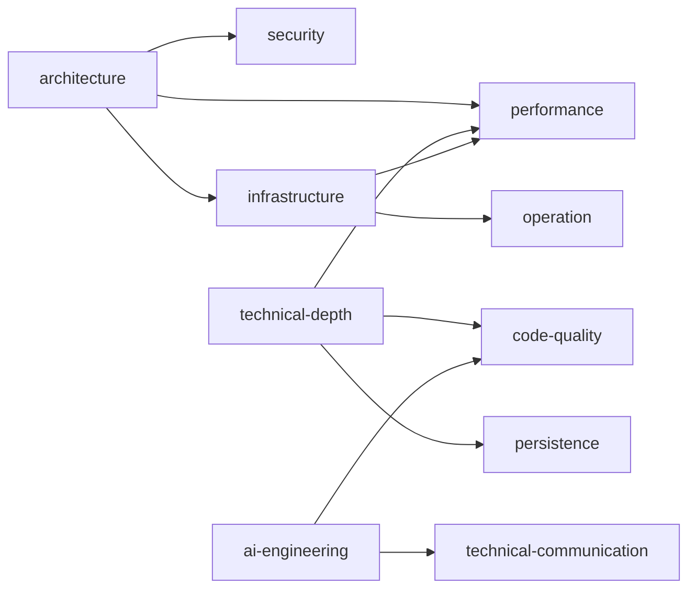

# Plano de Estudos

Centro do roadmap. Concentra:
- **Catálogo de Áreas** — todas as áreas e tópicos que o sistema conhece
  (fontes: roadmap.sh). O usuário pode adicionar áreas novas aqui.
- **Áreas de Foco** — quais áreas o usuário está estudando agora, com status
  e metas. É a instância pessoal do catálogo.

Gerado e mantido por `/wiki-roadmap`. As skills leem este arquivo para classificar
páginas e sugerir gaps. Edite à vontade — a LLM respeita edições manuais.

---

## Perfil

```yaml
profile:
  name: "Isabela Gomes"
  role: "Software Engineer Júnior II"
  area: "Backend / Logística"
  company: "iFood"
  horizon: "Jul–Dez 2026"
  hard_skills:
    languages: [Java, Go, Kotlin]
    frameworks: [Spring Boot]
    infra: [Kubernetes, Docker, Helm]
    data: [PostgreSQL, Redis, Kafka, Databricks]
    cloud: [AWS (ECS, RDS, SQS, SNS)]
    observability: [Datadog]
  soft_skills:
    methods: [Scrum, Kanban]
    communication: [code review, documentação técnica]
    leadership: [mentoria de júnior]
  objective: |
    1. Consolidar base em arquitetura de software
    2. Aumentar profundidade técnica na stack (Java, Go, Spring, Kafka, K8s)
    3. Desenvolver posicionamento ativo em discussões técnicas
    4. Aplicar IA ao desenvolvimento (context engineering, spec-driven dev)
  sources:
    roadmaps: [roadmap.sh/backend, roadmap.sh/ai-engineer, roadmap.sh/software-architect]
    pdi_corporativo: [feedback de performance (a adicionar)]
```

---

## Catálogo de Áreas

Catálogo canônico de áreas e tópicos. Derivado de roadmaps públicos.
Use como referência ao adicionar áreas novas ao seu plano.

Cada entrada: slug do tópico, nome legível, e pré-requisitos (`depends_on`).
O campo `covered_by` é preenchido automaticamente pelas skills quando
uma página da wiki cobre o tópico.

### architecture
(fonte: roadmap.sh/backend)

| Slug | Tópico | Depende de |
|------|--------|------------|
| `architectural-patterns` | Padrões Arquiteturais (Event-Driven, CQRS, Saga) | — |
| `system-design` | Design de Sistemas (escalabilidade, resiliência) | `architectural-patterns` |
| `adrs` | Architecture Decision Records | `system-design` |
| `distributed-systems` | Sistemas Distribuídos (CAP, consenso) | `system-design` |
| `integration-patterns` | Padrões de Integração (API Gateway, BFF, Strangler Fig) | `architectural-patterns` |
| `modularity` | Modularidade (coesão, acoplamento) | — |
| `connascence` | Conascência (Page-Jones, Weirich) | `modularity` |
| `fitness-functions` | Fitness Functions (governança automatizada) | `architectural-patterns` |
| `architecture-quantum` | Architecture Quantum | `architectural-patterns`, `connascence` |

### infrastructure
(fonte: roadmap.sh/backend + kubernetes)

| Slug | Tópico | Depende de |
|------|--------|------------|
| `container-runtime` | Container Runtime (containerd, CRI) | — |
| `kubernetes-core` | Kubernetes Core (Pods, Deployments, Services) | `container-runtime` |
| `cni` | CNI (Calico, Cilium) | `kubernetes-core` |
| `csi` | CSI (Storage Classes, PV/PVC) | `kubernetes-core` |
| `operators` | Kubernetes Operators (controller-runtime) | `kubernetes-core` |
| `service-mesh` | Service Mesh (Istio, Linkerd) | `kubernetes-core` |
| `iac` | Infrastructure as Code (Terraform, Pulumi) | — |
| `helm-kustomize` | Helm + Kustomize | `kubernetes-core` |
| `cicd` | CI/CD Pipelines (GitHub Actions, ArgoCD) | `kubernetes-core` |
| `ebpf` | eBPF Fundamentals | `kubernetes-core` |
| `observability` | Observabilidade (OpenTelemetry, métricas) | `kubernetes-core` |

### ai-engineering
(fonte: roadmap.sh/ai-engineer)

| Slug | Tópico | Depende de |
|------|--------|------------|
| `prompt-engineering` | Prompt Engineering (few-shot, chain-of-thought) | — |
| `mcp` | Model Context Protocol (transports, tools) | — |
| `code-agents` | Code Agents (Claude Code, Copilot, Codex) | `prompt-engineering` |
| `rag` | RAG Fundamentals (chunking, embeddings, vector DBs) | — |
| `agent-orchestration` | Orquestração de Agentes (multi-agent) | `code-agents` |
| `ai-safety` | AI Safety & Guardrails | `prompt-engineering` |

### technical-depth
(fonte: roadmap.sh/backend + golang)

| Slug | Tópico | Depende de |
|------|--------|------------|
| `go-profiling` | Go Profiling (pprof, benchmarks, race detector) | — |
| `java-gc` | Java GC Tuning (G1, ZGC, heap analysis) | — |
| `go-concurrency` | Go Concurrency (goroutines, channels, context) | — |
| `java-concurrency` | Java Concurrency (Virtual Threads, Loom) | — |
| `kafka-internals` | Kafka Internals (partitions, ISR, log compaction) | — |
| `jvm-internals` | JVM Internals (class loading, JIT, memory model) | `java-gc` |

### code-quality
(fonte: roadmap.sh/backend)

| Slug | Tópico | Depende de |
|------|--------|------------|
| `unit-testing` | Testes Unitários (JUnit, testify, mocks) | — |
| `integration-testing` | Testes de Integração (Testcontainers) | `unit-testing` |
| `e2e-testing` | Testes E2E (contract tests) | `integration-testing` |
| `static-analysis` | Análise Estática (SonarQube, golangci-lint) | — |
| `design-patterns` | Design Patterns aplicados à stack | — |

### performance
(fonte: roadmap.sh/backend)

| Slug | Tópico | Depende de |
|------|--------|------------|
| `profiling-methodology` | Metodologia de Profiling | — |
| `kafka-tuning` | Tuning de Kafka (throughput, latência, batching) | `kafka-internals` |
| `db-optimization` | Otimização de Banco (índices, query plans) | — |
| `caching-strategies` | Estratégias de Cache (Redis, in-memory) | — |
| `load-testing` | Teste de Carga (k6, wrk, JMeter) | `profiling-methodology` |

### persistence
(fonte: roadmap.sh/backend)

| Slug | Tópico | Depende de |
|------|--------|------------|
| `sql-advanced` | SQL Avançado (CTEs, window functions) | — |
| `nosql-modeling` | Modelagem NoSQL (documentos, grafos) | — |
| `transactions` | Transações Distribuídas (Saga, 2PC, outbox) | `sql-advanced` |
| `replication-sharding` | Replicação e Sharding | `sql-advanced` |

### security
(fonte: roadmap.sh/backend)

| Slug | Tópico | Depende de |
|------|--------|------------|
| `appsec` | Application Security (OWASP Top 10) | — |
| `auth-authorization` | Autenticação e Autorização (OAuth 2.0, OIDC) | — |
| `data-privacy` | Privacidade de Dados (LGPD/GDPR) | — |
| `secure-comms` | Comunicação Segura (mTLS, TLS 1.3) | `auth-authorization` |

### operation
(fonte: roadmap.sh/backend)

| Slug | Tópico | Depende de |
|------|--------|------------|
| `alerting` | Alerting & SLOs (Datadog, Prometheus, Grafana) | `observability` |
| `incident-response` | Resposta a Incidentes (post-mortems, runbooks) | `alerting` |
| `chaos-engineering` | Chaos Engineering | `observability` |

### technical-communication
(fonte: competências comportamentais)

| Slug | Tópico | Depende de |
|------|--------|------------|
| `tech-writing` | Escrita Técnica (RFCs, ADRs, documentação) | — |
| `diagramming` | Diagramação (C4, Mermaid, Excalidraw) | — |
| `presentations` | Apresentações Técnicas (lunch & learn, demos) | — |
| `code-review` | Code Review Efetiva | — |

### Para adicionar uma área nova

Adicione uma seção `### <slug-da-area>` seguindo o formato acima.
Liste os tópicos com `depends_on` para definir pré-requisitos.
As skills preencherão `covered_by` automaticamente.

---

## Áreas de Foco (Jul–Dez 2026)

Áreas que você está estudando ativamente. Ordenadas por prioridade.
Os slugs de tópico referenciam o Catálogo acima.

```yaml
focus_areas:
  - slug: ai-engineering
    name: IA Aplicada à Engenharia
    priority: critical
    why: |
      Objetivo declarado: "aplicar IA ao desenvolvimento".
      roadmap.sh/ai-engineer: 6 tópicos, nenhum coberto.
      Context engineering e spec-driven dev são o diferencial da próxima geração.
    topics:
      - slug: prompt-engineering
        status: pending
        covered_by: []
      - slug: mcp
        status: pending
        covered_by: []
      - slug: rag
        status: pending
        covered_by: []
      - slug: code-agents
        status: pending
        covered_by: []
      - slug: ai-safety
        status: pending
        covered_by: []
      - slug: agent-orchestration
        status: pending
        covered_by: []

  - slug: infrastructure
    name: Infraestrutura & Cloud
    priority: critical
    why: |
      roadmap.sh/backend + kubernetes: 11 tópicos, 0 cobertos.
      Stack inclui K8s no dia a dia — dominar a fundo.
      Base pra crescer além de "usuário de K8s".
    topics:
      - slug: container-runtime
        status: pending
        covered_by: []
      - slug: kubernetes-core
        status: pending
        covered_by: []
      - slug: operators
        status: pending
        covered_by: []
      - slug: cni
        status: pending
        covered_by: []
      - slug: csi
        status: pending
        covered_by: []
      - slug: iac
        status: pending
        covered_by: []
      - slug: cicd
        status: pending
        covered_by: []
      - slug: service-mesh
        status: pending
        covered_by: []
      - slug: helm-kustomize
        status: pending
        covered_by: []

  - slug: technical-depth
    name: Profundidade Técnica na Stack
    priority: high
    why: |
      Objetivo: "aumentar profundidade técnica na stack".
      Júnior II → Pleno: dominar o que usa no dia a dia.
      Go profiling, Java GC, Kafka internals.
    topics:
      - slug: go-profiling
        status: pending
        covered_by: []
      - slug: go-concurrency
        status: pending
        covered_by: []
      - slug: java-gc
        status: pending
        covered_by: []
      - slug: java-concurrency
        status: pending
        covered_by: []
      - slug: kafka-internals
        status: pending
        covered_by: []
      - slug: jvm-internals
        status: pending
        covered_by: []

  - slug: architecture
    name: Arquitetura de Software
    priority: medium
    why: |
      Objetivo: "consolidar base em arquitetura".
      6/9 tópicos já cobertos com páginas na wiki.
      Fechar os 3 gaps restantes: ADRs, distributed systems, integration patterns.
    topics:
      - slug: architectural-patterns
        status: covered
        covered_by: [wiki/concepts/arquitetura-de-software.md]
      - slug: modularity
        status: covered
        covered_by: [wiki/concepts/modularidade.md]
      - slug: connascence
        status: covered
        covered_by: [wiki/concepts/conascencia.md]
      - slug: fitness-functions
        status: covered
        covered_by: [wiki/concepts/fitness-functions.md]
      - slug: architecture-quantum
        status: covered
        covered_by: [wiki/concepts/architecture-quantum.md]
      - slug: system-design
        status: covered
        covered_by: [wiki/concepts/caracteristicas-arquiteturais.md]
      - slug: adrs
        status: pending
        covered_by: []
      - slug: distributed-systems
        status: pending
        covered_by: []
      - slug: integration-patterns
        status: pending
        covered_by: []

  - slug: technical-communication
    name: Comunicação & Posicionamento Técnico
    priority: medium
    why: |
      Objetivo: "posicionamento ativo em discussões técnicas".
      Eliminar passividade e insegurança.
      Área comportamental — prática no dia a dia.
    topics:
      - slug: tech-writing
        status: pending
        covered_by: []
      - slug: code-review
        status: pending
        covered_by: []
      - slug: diagramming
        status: pending
        covered_by: []
      - slug: presentations
        status: pending
        covered_by: []
```

## Relações entre Áreas



## Histórico de Checkpoints

| Data | Evento | Detalhe |
|------|--------|---------|
| 2026-07-12 | /wiki-roadmap refatoração | Perfil atualizado (Júnior II, Logística). 5 áreas: ai-engineering, infrastructure, technical-depth, architecture, technical-communication. Fontes: backend + ai-engineer + software-architect |
| 2026-07-12 | /wiki-roadmap inicial | Refatoração do sistema de competências |
