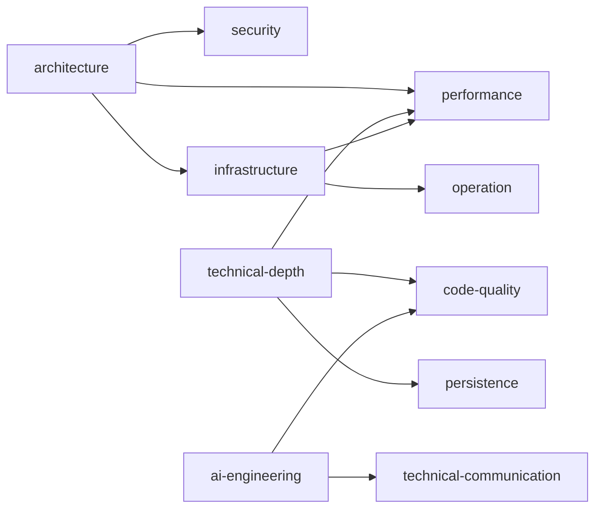

# Plano de Estudos

Centro do roadmap. Concentra:
- **Catálogo de Áreas** — todas as áreas e tópicos que o sistema conhece
  (fontes: roadmap.sh). O usuário pode adicionar áreas novas aqui.
- **Áreas de Foco** — quais áreas o usuário está estudando, com status.
  Preenchido pelo `/wiki-roadmap`.

Gerado e mantido por `/wiki-roadmap`. As skills leem este arquivo para classificar
páginas e sugerir gaps.

---

## Perfil

```yaml
# Preenchido automaticamente pelo /wiki-roadmap.
# Rode o comando para configurar.
profile: {}
```

---

## Catálogo de Áreas

Catálogo canônico de áreas e tópicos. Derivado de roadmaps públicos.
Use como referência ao adicionar áreas novas ao seu plano.

Cada entrada: slug do tópico, nome legível, e pré-requisitos (`depends_on`).
O campo `covered_by` é preenchido automaticamente pelas skills quando
uma página da wiki cobre o tópico.

### architecture
(fonte: roadmap.sh/backend)

| Slug | Tópico | Depende de |
|------|--------|------------|
| `architectural-patterns` | Padrões Arquiteturais (Event-Driven, CQRS, Saga) | — |
| `system-design` | Design de Sistemas (escalabilidade, resiliência) | `architectural-patterns` |
| `adrs` | Architecture Decision Records | `system-design` |
| `distributed-systems` | Sistemas Distribuídos (CAP, consenso) | `system-design` |
| `integration-patterns` | Padrões de Integração (API Gateway, BFF, Strangler Fig) | `architectural-patterns` |
| `modularity` | Modularidade (coesão, acoplamento) | — |
| `connascence` | Conascência (Page-Jones, Weirich) | `modularity` |
| `fitness-functions` | Fitness Functions (governança automatizada) | `architectural-patterns` |
| `architecture-quantum` | Architecture Quantum | `architectural-patterns`, `connascence` |

### infrastructure
(fonte: roadmap.sh/backend + kubernetes)

| Slug | Tópico | Depende de |
|------|--------|------------|
| `container-runtime` | Container Runtime (containerd, CRI) | — |
| `kubernetes-core` | Kubernetes Core (Pods, Deployments, Services) | `container-runtime` |
| `cni` | CNI (Calico, Cilium) | `kubernetes-core` |
| `csi` | CSI (Storage Classes, PV/PVC) | `kubernetes-core` |
| `operators` | Kubernetes Operators (controller-runtime) | `kubernetes-core` |
| `service-mesh` | Service Mesh (Istio, Linkerd) | `kubernetes-core` |
| `iac` | Infrastructure as Code (Terraform, Pulumi) | — |
| `helm-kustomize` | Helm + Kustomize | `kubernetes-core` |
| `cicd` | CI/CD Pipelines (GitHub Actions, ArgoCD) | `kubernetes-core` |
| `ebpf` | eBPF Fundamentals | `kubernetes-core` |
| `observability` | Observabilidade (OpenTelemetry, métricas) | `kubernetes-core` |

### ai-engineering
(fonte: roadmap.sh/ai-engineer)

| Slug | Tópico | Depende de |
|------|--------|------------|
| `prompt-engineering` | Prompt Engineering (few-shot, chain-of-thought) | — |
| `mcp` | Model Context Protocol (transports, tools) | — |
| `code-agents` | Code Agents (Claude Code, Copilot, Codex) | `prompt-engineering` |
| `rag` | RAG Fundamentals (chunking, embeddings, vector DBs) | — |
| `agent-orchestration` | Orquestração de Agentes (multi-agent) | `code-agents` |
| `ai-safety` | AI Safety & Guardrails | `prompt-engineering` |

### technical-depth
(fonte: roadmap.sh/backend + golang)

| Slug | Tópico | Depende de |
|------|--------|------------|
| `go-profiling` | Go Profiling (pprof, benchmarks, race detector) | — |
| `java-gc` | Java GC Tuning (G1, ZGC, heap analysis) | — |
| `go-concurrency` | Go Concurrency (goroutines, channels, context) | — |
| `java-concurrency` | Java Concurrency (Virtual Threads, Loom) | — |
| `kafka-internals` | Kafka Internals (partitions, ISR, log compaction) | — |
| `jvm-internals` | JVM Internals (class loading, JIT, memory model) | `java-gc` |

### code-quality
(fonte: roadmap.sh/backend)

| Slug | Tópico | Depende de |
|------|--------|------------|
| `unit-testing` | Testes Unitários (JUnit, testify, mocks) | — |
| `integration-testing` | Testes de Integração (Testcontainers) | `unit-testing` |
| `e2e-testing` | Testes E2E (contract tests) | `integration-testing` |
| `static-analysis` | Análise Estática (SonarQube, golangci-lint) | — |
| `design-patterns` | Design Patterns aplicados à stack | — |

### performance
(fonte: roadmap.sh/backend)

| Slug | Tópico | Depende de |
|------|--------|------------|
| `profiling-methodology` | Metodologia de Profiling | — |
| `kafka-tuning` | Tuning de Kafka (throughput, latência, batching) | `kafka-internals` |
| `db-optimization` | Otimização de Banco (índices, query plans) | — |
| `caching-strategies` | Estratégias de Cache (Redis, in-memory) | — |
| `load-testing` | Teste de Carga (k6, wrk, JMeter) | `profiling-methodology` |

### persistence
(fonte: roadmap.sh/backend)

| Slug | Tópico | Depende de |
|------|--------|------------|
| `sql-advanced` | SQL Avançado (CTEs, window functions) | — |
| `nosql-modeling` | Modelagem NoSQL (documentos, grafos) | — |
| `transactions` | Transações Distribuídas (Saga, 2PC, outbox) | `sql-advanced` |
| `replication-sharding` | Replicação e Sharding | `sql-advanced` |

### security
(fonte: roadmap.sh/backend)

| Slug | Tópico | Depende de |
|------|--------|------------|
| `appsec` | Application Security (OWASP Top 10) | — |
| `auth-authorization` | Autenticação e Autorização (OAuth 2.0, OIDC) | — |
| `data-privacy` | Privacidade de Dados (LGPD/GDPR) | — |
| `secure-comms` | Comunicação Segura (mTLS, TLS 1.3) | `auth-authorization` |

### operation
(fonte: roadmap.sh/backend)

| Slug | Tópico | Depende de |
|------|--------|------------|
| `alerting` | Alerting & SLOs (Datadog, Prometheus, Grafana) | `observability` |
| `incident-response` | Resposta a Incidentes (post-mortems, runbooks) | `alerting` |
| `chaos-engineering` | Chaos Engineering | `observability` |

### technical-communication
(fonte: competências comportamentais)

| Slug | Tópico | Depende de |
|------|--------|------------|
| `tech-writing` | Escrita Técnica (RFCs, ADRs, documentação) | — |
| `diagramming` | Diagramação (C4, Mermaid, Excalidraw) | — |
| `presentations` | Apresentações Técnicas (lunch & learn, demos) | — |
| `code-review` | Code Review Efetiva | — |

### Para adicionar uma área nova

Adicione uma seção `### <slug-da-area>` seguindo o formato acima.
Liste os tópicos com `depends_on` para definir pré-requisitos.
As skills preencherão `covered_by` automaticamente.

---

## Áreas de Foco

```yaml
# Preenchido pelo /wiki-roadmap após configurar o perfil.
# Rode o comando para gerar suas áreas de foco.
focus_areas: []
```

## Relações entre Áreas



## Histórico de Checkpoints

| Data | Evento | Detalhe |
|------|--------|---------|
