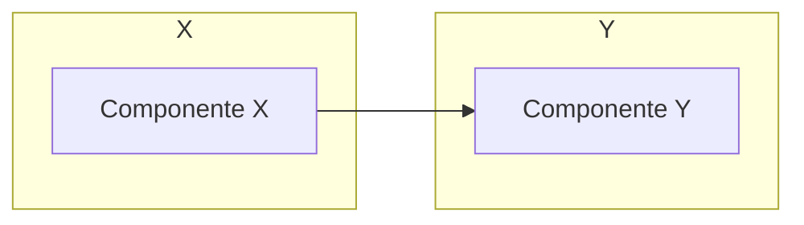

# Comparação: X vs Y

## Contexto

<!-- LLM: O que motiva esta comparação. Quando alguém precisa escolher entre X e Y. Cenário típico. -->

## Tabela Comparativa

| Critério | X | Y |
|---|---|---|
| Definição |  |  |
| Quando usar |  |  |
| Vantagens |  |  |
| Desvantagens |  |  |
| Exemplo concreto |  |  |

<!-- LLM: se aplicável, diagrama Mermaid mostrando a diferença estrutural ou de fluxo -->

## Análise

<!-- LLM: discussão aprofundada — não apenas a tabela, mas trade-offs, nuances, contextos onde a escolha não é óbvia. Use callouts para destacar pontos importantes. -->

> [!warning] Nuance importante
> <!-- LLM: algo que a tabela simplifica demais e merece explicação extra -->

## Quando escolher cada um

| Cenário | Recomendação | Por quê |
|---|---|---|
|  |  |  |

## Conexões

- [[pagina-relacionada|Nome de Exibição]]

> [!note] Páginas futuras
> <!-- LLM: outras comparações relacionadas que ainda não existem -->
