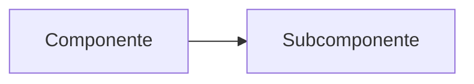

# Título do Conceito

<!-- LLM: parágrafo de abertura que define o conceito em linguagem clara, com exemplo concreto quando possível. Não é uma definição de dicionário — é a explicação que você daria para um colega. -->

## Definição

<!-- LLM: definição formal, com os elementos essenciais. Se houver múltiplas definições (ex: diferentes autores), apresente e aponte diferenças. -->

> [!quote] Citação relevante
> <!-- LLM: se a fonte tiver uma frase marcante que encapsula o conceito, destaque aqui -->

## Características principais

<!-- LLM: atributos, propriedades ou dimensões do conceito. Use tabela se forem muitos, use bullet points se forem simples. -->

| Característica | Descrição |
|---|---|
| <!-- ex: nome --> | <!-- ex: o que significa --> |

<!-- LLM: se aplicável, adicione aqui um diagrama Mermaid mostrando a estrutura ou fluxo do conceito -->

## Por que é importante

<!-- LLM: relevância prática. Não é teoria — é "o que isso muda no meu dia a dia como engenheira?". Conexão com problemas reais. -->

## Implicações Práticas

<!-- LLM: o que significa na prática. Exemplos do dia a dia, armadilhas comuns, como aplicar. -->

> [!tip] Dica prática
> <!-- LLM: atalho mental, heurística, ou boa prática para aplicar o conceito -->

> [!warning] Armadilha comum
> <!-- LLM: erro frequente ao aplicar esse conceito -->

## Conexões

<!-- LLM: wikilinks para páginas relacionadas usando pipe syntax. Mínimo 2. -->

- [[pagina-relacionada|Nome de Exibição]]

> [!note] Páginas futuras
> <!-- LLM: conceitos relacionados que merecem página própria mas ainda não atingiram o limiar de criação -->

## Fontes

- <!-- LLM: link para raw/ -->
