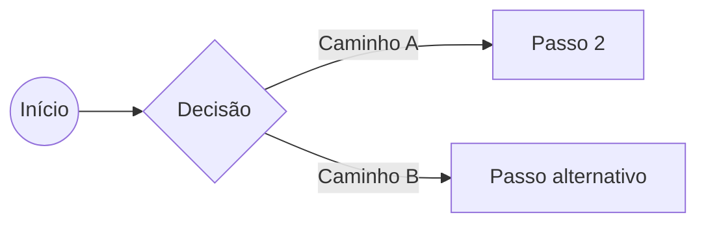

# Título da Recipe

## Contexto

<!-- LLM: Por que dessa abordagem. O problema e a decisão. É o que você vai querer ler 6 meses depois. -->

## Quando usar

- Use quando: ...
- Não use quando: ...

## Passo a passo

1. **Passo 1** — O que fazer e por quê.
   ```<linguagem>
   <!-- comando/código -->
   ```

2. **Passo 2** — ...
   ```<linguagem>
   ```

3. **Passo 3** — ...

<!-- LLM: se o fluxo tiver decisões, adicione um diagrama Mermaid -->



## Armadilhas

> [!warning] Cuidado
> <!-- LLM: o que costuma dar errado e como evitar -->

## Conexões

- [[pagina-relacionada|Nome de Exibição]]
