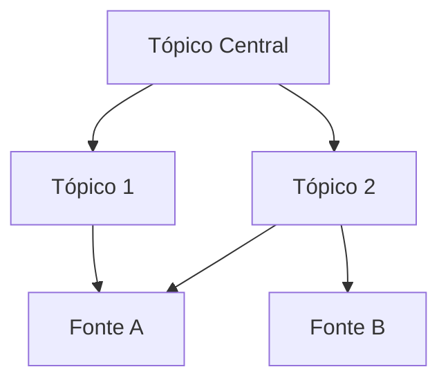

# Título da Síntese

## Visão Geral

<!-- LLM: o que esta síntese cobre — quais fontes foram integradas (livros, artigos, cursos). O propósito da página. -->

## Estrutura

<!-- LLM: tópicos principais organizados de forma coesa. Diferente de uma fonte linear, aqui os temas são integrados. -->

### Tópico 1

<!-- LLM: desenvolvimento do tópico, com conexões entre fontes -->

### Tópico 2

<!-- LLM: ... -->

## Insights Integrados

<!-- LLM: conexões entre fontes que não estavam explícitas em nenhuma delas isoladamente. É o valor real de uma summary — o que emerge da combinação. -->

> [!note] Conexão entre fontes
> <!-- LLM: insight específico que só aparece quando você junta fonte A e fonte B -->

## Mapa Visual

<!-- LLM: diagrama Mermaid mostrando como os tópicos se relacionam -->

## Conexões

- [[pagina-relacionada|Nome de Exibição]]

## Fontes

- <!-- LLM: lista completa de fontes em raw/ que alimentaram esta síntese -->
