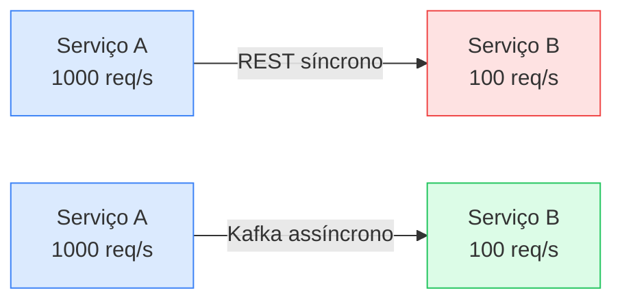

# Architecture Quantum

Por uma década, o mundo do software assumiu que características arquiteturais (escalabilidade, segurança, elasticidade) valiam para o **sistema inteiro**. Fazia sentido: 95% dos sistemas eram monolíticos. Com microservices, esse axioma quebrou — e o architecture quantum é o substituto.

## Definição

> [!note] Definição formal
> Um **architecture quantum** é um artefato independentemente deployável, com alta coesão funcional e conascência síncrona.

Em termos práticos: é a **menor unidade de escopo** para a qual você define características arquiteturais. Em vez de perguntar "meu sistema é escalável?", pergunte "quais pedaços do meu sistema precisam ser escaláveis, e em que nível?"

A palavra *quantum* vem do latim "quanto" ou "quão grande" — emprestada da física, onde designa a menor unidade de uma entidade envolvida numa interação.

## Os três critérios

Cada parte da definição resolve um problema específico:

### 1. Independentemente deployável

O quantum inclui **tudo** que o negócio precisa para funcionar sozinho — não só o código, mas dependências externas que impactam características operacionais.

> [!example] Exemplo
> Um serviço de Pedidos que usa PostgreSQL + Redis: **ambos fazem parte do quantum**. Se o banco não escala junto com o serviço, a característica "escalabilidade" não é atendida — mesmo que o código esteja perfeito.

Isso explica por que um monolito com banco único = **1 quantum só**: tudo é deployado junto, tudo compartilha o mesmo banco. Já numa arquitetura de microservices com banco por serviço, **cada serviço + seu banco** forma um quantum distinto.

> [!tip] Na prática: Kubernetes e sidecars
> Um pod com sidecar (ex: Envoy proxy + app Spring Boot) forma **um quantum só**. O sidecar não é deployado independentemente — ele existe em função do app, sem coesão funcional própria. Já dois pods que se comunicam via Kafka são **dois quanta diferentes**, com características operacionais potencialmente distintas.

### 2. Alta coesão funcional

O quantum faz **uma coisa com propósito claro**. Herda a filosofia do [[conascencia#Domain-Driven Design's Bounded Context|bounded context]] do DDD (Eric Evans): cada domínio tem seu próprio modelo, reconciliando diferenças nos pontos de integração.

| Antes do DDD | Com bounded context |
|---|---|
| Uma classe `Customer` unificada para toda a empresa | Cada domínio define seu `Customer`: financeiro tem billing info, suporte tem histórico de tickets |
| Acoplamento global — qualquer mudança quebra algo | Acoplamento localizado — mudanças no `Customer` do financeiro não afetam o suporte |

Em microservices, cada serviço tipicamente mapeia para um bounded context → alta coesão funcional por design.

### 3. Conascência síncrona

O critério mais sutil e poderoso. [[conascencia|Conascência]] é quando duas componentes são acopladas de tal forma que mudar uma obriga a mudar a outra. O architecture quantum foca na **conascência síncrona de runtime**:

> [!warning] Síncrono (REST/gRPC)
> Se A escala 100x mais que B, **timeouts explodem**. Durante a chamada, as características operacionais de A e B precisam ser compatíveis. Isso é conascência síncrona: um espera o outro.

> [!tip] Assíncrono (Kafka/RabbitMQ)
> A fila absorve a diferença de ritmo. B pode ser mais lento — as mensagens acumulam, mas ninguém morre. **Menos conascência = mais flexibilidade = times evoluem em velocidades diferentes.**

**Exemplo real:** um endpoint de DELETE que processava arquivos grandes e dava timeout. A solução foi tornar a operação fire-and-forget: o cliente recebe 202 Accepted imediatamente e o processamento real roda assíncrono. Trocar conascência síncrona por assíncrona resolveu o scaling sem mudar a infraestrutura.

## O kata Going, Going, Gone

O capítulo demonstra o conceito com um kata de leilão online. Requisitos:

- Centenas de participantes por leilão, lances em tempo real
- Stream de vídeo ao vivo
- Cartão de crédito com cobrança automática
- Empresa processada por fraude

### Antes: pensamento tradicional

Um arquiteto listaria "security, scalability, performance, availability" e aplicaria em **tudo** — mesmo tratamento, sistema inteiro.

### Depois: análise por quanta

Três unidades com características diferentes:

```mermaid
graph LR
    subgraph feedback["BIDDER FEEDBACK"]
        direction TB
        F1["Availability"]
        F2["Scalability"]
        F3["Performance"]
    end

    subgraph auctioneer["AUCTIONEER"]
        direction TB
        A1["Availability"]
        A2["Reliability"]
        A3["Scalability"]
        A4["Elasticity"]
        A5["Performance"]
        A6["Security"]
    end

    subgraph bidder["BIDDER"]
        direction TB
        B1["Reliability"]
        B2["Availability"]
        B3["Scalability"]
        B4["Elasticity"]
    end

    feedback -->|"assíncrono"| auctioneer
    auctioneer -->|"assíncrono"| bidder

    style feedback fill:#dbeafe,stroke:#3b82f6
    style auctioneer fill:#fef9c3,stroke:#eab308
    style bidder fill:#dcfce7,stroke:#22c55e
```

Por que o **Auctioneer** tem 6 características e o **Bidder** só 4?

- Auctioneer caiu → **ninguém** dá lance. Disponibilidade é existencial. Security é crítico (fraude no passado).
- Bidder individual caiu → outros 499 continuam. A disponibilidade importa, mas não no mesmo nível.
- Bidder Feedback (stream de vídeo) → não precisa de security nem reliability. Perder um frame não é catastrófico.

> [!important] Insight central
> Diferentes partes da arquitetura exigem diferentes níveis das mesmas características. Isso leva naturalmente a **arquiteturas híbridas** — e o architecture quantum permite identificar esses limites já na fase de design, não depois do deploy.

## Litmus test: domínio vs arquitetura

Como decidir se algo é característica arquitetural ou só requisito de domínio?

> **Pergunte:** "Dá pra discutir isso em abstrato, sem conhecer o negócio?"

| É característica arquitetural | É domínio |
|---|---|
| Elasticidade — independe de ser banking, streaming ou e-commerce | "Índice de reputação" — preciso de um analista de negócio para explicar |
| Performance — vale para qualquer sistema com usuários | "Regra de cobrança automática do cartão" — específico do negócio de leilões |

Na prática: se você precisa **falar com pessoa de produto** para entender o que significa, provavelmente é domínio, não característica arquitetural.

## Conexões

- [[caracteristicas-arquiteturais|Características Arquiteturais]] — o *quê* são as -ilities que você define por quantum
- [[identificacao-caracteristicas-arquiteturais|Identificação de Características Arquiteturais]] — o *como* descobrir quais características cada quantum precisa
- [[medicao-caracteristicas-arquiteturais|Medição de Características Arquiteturais]] — o *como* medir se cada quantum está entregando suas características
- [[fitness-functions|Fitness Functions]] — governança automatizada que verifica características por quantum
- [[conascencia|Conascência]] — o conceito de acoplamento que fundamenta o critério de conascência síncrona
- [[../concepts/modularidade|Modularidade]] — coesão funcional e acoplamento como precursores do quantum
