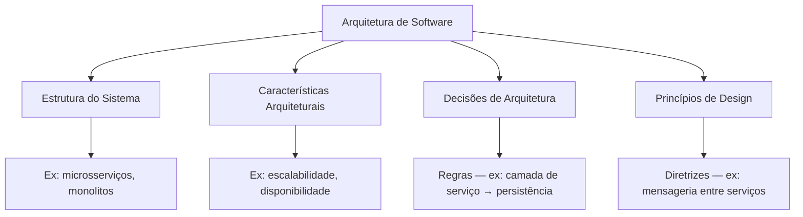

# Arquitetura de Software

Arquitetura de software não é só "o desenho do sistema". O livro define como a combinação de quatro dimensões:

![[arquitetura-software-dimensoes.png]]

| Dimensão                          | Tipo                          | Exemplo                                                 |
| --------------------------------- | ----------------------------- | ------------------------------------------------------- |
| **Estrutura do sistema**          | O "o quê" — a topologia       | Microsserviços, monolitos, arquiteturas em camadas      |
| **Características arquiteturais** | O "para quê" — os "-ilities"  | Escalabilidade, disponibilidade, performance, segurança |
| **Decisões de arquitetura**       | Regras (hard constraints)     | "Só a camada de serviço pode acessar o banco"           |
| **Princípios de design**          | Diretrizes (soft constraints) | "Prefira mensageria assíncrona entre serviços"          |

A diferença entre decisão e princípio é importante: uma **decisão** é binária (ou segue, ou quebra a arquitetura), um **princípio** é uma recomendação que admite exceções justificadas. No dia a dia, um exemplo seria: "todo microsserviço novo deve expor health check" é decisão; "prefira Kafka para comunicação entre domínios" é princípio.

## As Duas Leis da Arquitetura de Software

**1ª Lei: Tudo é uma concessão (trade-off).** Nenhuma decisão arquitetural tem apenas um lado bom. Escalabilidade custa complexidade operacional. Segurança custa latência. Microsserviços dão autonomia mas custam consistência e debugging distribuído. Se um arquiteto acha que algo não é uma concessão, é porque ainda não a identificou — ou porque o custo ainda não apareceu.

**2ª Lei: O porquê é mais importante do que o como.** Uma pessoa consegue olhar para o código de um sistema e deduzir *como* ele foi estruturado. Mas descobrir *por que* foi estruturado daquele jeito (e não de outro) exige documentação de decisão — é o que diferencia um ADR de um diagrama de deploy. Sem o "porquê", futuros mantenedores podem repetir decisões ruins ou desfazer boas escolhas sem perceber.

## Arquitetura é produto do contexto

Toda arquitetura é filha do seu tempo. Microsserviços em 2002 não fariam sentido — a maioria das empresas tinha datacenter próprio, não existia Kubernetes, e o custo de operar dezenas de serviços era proibitivo. Hoje, com cloud e orquestração, é uma escolha viável (não obrigatória). A implicação prática: **não existe "melhor arquitetura" em abstrato** — existe a arquitetura certa para o contexto atual (time, recursos, maturidade, restrições de negócio).

## Diagrama

## Conexões

- [[acompanhamento-competencias|Mapa de Estudos]] — esta página cobre `architecture`, `technical-breadth` e `code-quality`.

> [!note] Páginas futuras
> As leis da arquitetura (trade-off e porquê > como) pedem páginas próprias, mas ainda não atingiram o limiar de criação (precisam de mais fontes). Conforme os capítulos seguintes desenvolverem esses temas, a LLM vai sugerir extraí-los.
