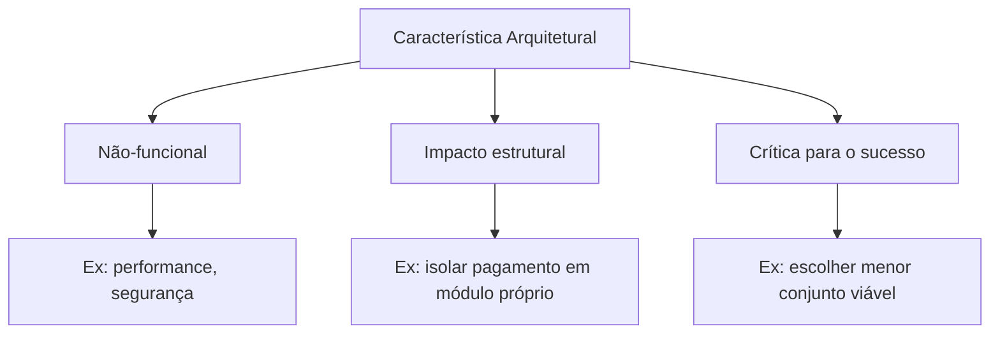

# Características Arquiteturais

Características arquiteturais (também chamadas de *non-functional requirements*, *quality attributes* ou *-ilities*) são os critérios de design que **não fazem parte do domínio funcional**, mas definem se o sistema vai ter sucesso em produção.

![[caracteristicas-arquiteturais-criterios.png]]

Pra algo ser uma característica arquitetural, precisa atender três critérios:
1. **Especifica uma consideração de design não-funcional** — não é sobre *o que* o sistema faz, mas *como* ele faz
2. **Influencia algum aspecto estrutural do design** — exige decisões de estrutura, não só boas práticas
3. **É crítica para o sucesso da aplicação** — se falhar nisso, o sistema falha

## Implícitas vs. Explícitas

| Tipo | Definição | Exemplo |
|---|---|---|
| **Implícita** | Raramente aparece em documento de requisito, mas é essencial para o sucesso | Disponibilidade, segurança básica, "prevenir débito técnico" |
| **Explícita** | Aparece em requisitos documentados ou instruções específicas | "O sistema precisa suportar 10k req/s", "tem que rodar em Oracle e SAP DB" |

Arquitetos precisam usar conhecimento de domínio para descobrir as implícitas. Numa empresa de high-frequency trading, baixa latência é implícita em todo sistema — ninguém escreve isso, mas todos sabem.

## Categorias

### Operacionais

Definem como o sistema se comporta em produção.

| Característica | Definição |
|---|---|
| **Disponibilidade** | Por quanto tempo o sistema precisa estar operacional. Se 24/7, precisa de failover rápido. |
| **Continuidade** | Capacidade de recuperação de desastres. |
| **Performance** | Stress testing, análise de pico, capacidade, tempos de resposta. |
| **Recuperabilidade** | Quão rápido o sistema volta ao ar após um desastre. Afeta estratégia de backup. |
| **Confiabilidade/Segurança** | O sistema precisa ser fail-safe? Se falhar, custa muito dinheiro? |
| **Robustez** | Capacidade de lidar com erros, queda de conexão, falha de hardware. |
| **Escalabilidade** | Capacidade de manter performance conforme usuários/requisições aumentam. |

### Estruturais

Dizem respeito à qualidade interna do código e à capacidade de evoluir.

| Característica | Definição |
|---|---|
| **Configurabilidade** | Usuários finais conseguem mudar aspectos do software via interfaces. |
| **Extensibilidade** | Quão importante é plugar novas funcionalidades. |
| **Instalabilidade** | Facilidade de instalar em todas as plataformas necessárias. |
| **Reaproveitamento** | Capacidade de usar componentes comuns em múltiplos produtos. |
| **Localização** | Suporte a múltiplos idiomas, moedas, unidades de medida. |
| **Manutenibilidade** | Quão fácil é aplicar mudanças e melhorar o sistema. |
| **Portabilidade** | O sistema precisa rodar em mais de uma plataforma? |
| **Suportabilidade** | Nível de logging e debugging necessários para operar. |
| **Atualizabilidade** | Facilidade de upgrade entre versões. |

### Transversais (Cross-Cutting)

Não se encaixam perfeitamente nas outras categorias, mas são restrições de design importantes.

| Característica | Definição |
|---|---|
| **Acessibilidade** | Acesso para todos os usuários, incluindo pessoas com deficiência. |
| **Arquivabilidade** | Dados precisam ser arquivados ou deletados após um período? |
| **Autenticação** | Garantir que usuários são quem dizem ser. |
| **Autorização** | Usuários só acessam funções permitidas (por caso de uso, subsistema, campo). |
| **Legal** | Restrições legislativas (LGPD, GDPR, Sarbanes-Oxley). |
| **Privacidade** | Ocultar transações até de DBAs e administradores de rede. |
| **Segurança** | Dados criptografados em repouso e em trânsito. |
| **Usabilidade** | Nível de treinamento necessário para o usuário atingir seus objetivos. |

> [!warning] Nenhuma lista é completa
> Cada organização pode inventar suas próprias características. O livro conta a história da **Italy-ility**: um cliente que exigia que toda arquitetura sobrevivesse à perda de comunicação com a Itália — uma combinação única de disponibilidade, recuperabilidade e resiliência que virou requisito arquitetural próprio.

## Trade-offs e a Arquitetura "Menos Pior"

Cada característica suportada adiciona complexidade ao design. O problema maior é que as características **interagem entre si** — melhorar uma frequentemente degrada outra.

> [!important] Metáfora do Helicóptero
> Pilotar helicóptero exige um controle em cada mão e cada pé, e mexer em um afeta os outros. Escolher características arquiteturais é o mesmo exercício de equilíbrio.

**Nunca mire na melhor arquitetura, mas na menos pior.** Arquiteturas que tentam resolver todos os problemas viram soluções genéricas e pesadas que raramente funcionam.

A saída é **iteração**: se você consegue mudar a arquitetura com facilidade, não precisa acertar de primeira. Isso vale tanto para código quanto para arquitetura.

## Conexões

- [[arquitetura-de-software|Arquitetura de Software]] — características arquiteturais são uma das 4 dimensões da arquitetura
- [[modularidade|Modularidade]] — modularidade é uma característica estrutural
- [[identificacao-caracteristicas-arquiteturais|Identificação de Características Arquiteturais]] — como identificar quais -ilities importam (Cap 5)
- [[medicao-caracteristicas-arquiteturais|Medição de Características Arquiteturais]] — como medir as -ilities com métricas objetivas (Cap 6)
- [[fitness-functions|Fitness Functions]] — governança automatizada das características arquiteturais (Cap 6)
- [[acompanhamento-competencias|Mapa de Estudos]] — cobre `architecture`, `technical-breadth`, `security`, `operation`, `performance`

> [!note] Páginas futuras
> **Trade-off arquitetural** — o cap 4 introduz o conceito mas o livro dedica capítulos posteriores a ele. Criar página quando houver mais fontes.
> **ISO 25010** — o padrão ISO de características de qualidade é abordado superficialmente. Criar se aparecer em outra fonte.
