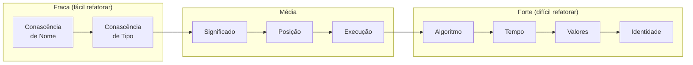
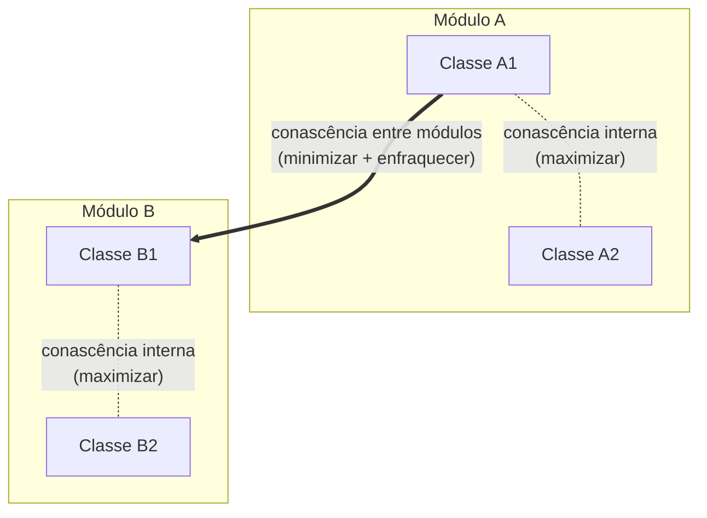

# Conascência

Dois componentes são **conascentes** se uma mudança em um **obriga** a mudança no outro para manter o sistema correto. Diferente do acoplamento (que só conta conexões), a conascência classifica **o tipo e a severidade** dessas dependências.

> [!info] Conascência vs Acoplamento
> A conascência é uma **evolução** do conceito de acoplamento. O acoplamento diz "A depende de B". A conascência diz "A depende de B **de que jeito?** E quão doloroso é mudar?". Não são conceitos rivais — a conascência refina o acoplamento com uma taxonomia mais precisa.

---

## Conascência Estática

Se refere ao acoplamento em nível de **código fonte** — detectável sem executar o sistema.

| Tipo | Definição | Exemplo | Gravidade |
|---|---|---|---|
| **Nome** | Múltiplos componentes concordam com o nome de uma entidade | Renomear `getCustomer` para `fetchCustomer` quebra todos os chamadores | Baixa — refatoração automática resolve |
| **Tipo** | Múltiplos componentes concordam com o tipo de uma entidade | Uma função espera `int` mas recebe `string` após mudança | Baixa — compilador pega (em linguagens tipadas) |
| **Significado** | Múltiplos componentes concordam com o significado de certos valores | `status = 1` significa "ativo" em um lugar e "pendente" em outro. Usar `true`/`false` como número mágico | Média — constante ou enum resolve |
| **Posição** | Múltiplos componentes concordam com a ordem dos valores | `calculateTax(income, 0.1, true)` — mudar a ordem dos parâmetros quebra todos os chamadores | Média — usar objetos/structs como parâmetro resolve |
| **Algoritmo** | Múltiplos componentes concordam com o mesmo algoritmo | Serviço A serializa com um algoritmo de hash, Serviço B valida com o mesmo algoritmo. Se o hash mudar, B quebra | Alta — exige coordenação entre times/serviços |

> [!example] Exemplo real de Conascência de Algoritmo
> Se um serviço de `routing` gera um hash de rota com determinado algoritmo e o serviço de `tracking` valida esse hash, ambos são conascentes por algoritmo. Mudar o hash no `routing` sem avisar o `tracking` quebra a validação em produção.

---

## Conascência Dinâmica

Se refere ao acoplamento em tempo de **execução** — só aparece quando o sistema roda.

| Tipo | Definição | Exemplo | Gravidade |
|---|---|---|---|
| **Execução** | A ordem de execução entre componentes importa | `inicializarConexao()` precisa rodar antes de `enviarMensagem()` | Média — documentar contrato ou usar pattern (ex: Builder) |
| **Tempo** | O timing da execução entre componentes importa | Dois serviços competem por um lock distribuído — se o timeout de um muda, o outro pode ficar sem lock | Alta — difícil de testar, race conditions |
| **Valores** | Vários valores se relacionam e precisam mudar juntos | Um pedido tem `subtotal`, `taxa_entrega` e `total`. Se a regra do `total` mudar, todos os sistemas que leem `total` precisam ser atualizados | Alta — comum em sistemas distribuídos |
| **Identidade** | Vários componentes precisam referenciar a mesma entidade | Dois microsserviços compartilham o mesmo `order_id`. Se um mudar o formato do ID (ex: de int pra UUID), o outro quebra | Alta — usar schema registry ou contrato compartilhado |

> [!warning] Conascência de Identidade em microsserviços
> É uma das causas mais comuns de incidentes em arquiteturas distribuídas. Quando um serviço muda o formato do ID e outro que depende dele ainda espera o formato antigo, a integração simplesmente para de funcionar — sem erro de compilação, sem alarme no deploy.

---

## Propriedades da Conascência

### Força

Define a facilidade com que um desenvolvedor pode refatorar aquele tipo de conascência:

![[conascencia-forca.png|400]]

### Localização

Mede a **proximidade** dos módulos conascentes. O mesmo tipo de conascência tem impacto diferente dependendo da distância:

| Distância | Tolerância a conascência forte | Exemplo |
|---|---|---|
| Mesma classe | Alta | Conascência de algoritmo entre dois métodos privados é OK |
| Classes diferentes, mesmo pacote | Média | Conascência de valores entre classes do mesmo domínio |
| Módulos/serviços diferentes | **Baixa** | Conascência de identidade entre dois microsserviços é perigosa |

> [!tip] A regra de ouro
> **Quanto maior a distância, mais fraca deve ser a conascência.** Dentro da mesma classe, conascência de algoritmo é tolerável. Entre microsserviços diferentes, até conascência de nome já exige cuidado (ex: compartilhar nomes de eventos Kafka).

### Grau

Mede o **tamanho do impacto** — quantas classes ou módulos são afetados por uma mudança? Um método usado por 200 classes tem grau maior que um método usado por 3.

---

## As Três Diretrizes de Page-Jones

Meilir Page-Jones sintetizou o uso prático da conascência em três regras:

1. **Minimizar a conascência em geral** — encapsular o máximo possível dentro de módulos.
2. **Minimizar a conascência que cruza limites de encapsulamento** — o que não deu pra encapsular, tente reduzir nas fronteiras entre módulos.
3. **Maximizar a conascência dentro dos limites de encapsulamento** — dentro do módulo, conascência é segura porque o impacto de mudanças é controlado.

---

## Os Conselhos de Jim Weirich

Jim Weirich popularizou novamente a conascência e a resumiu em duas regras práticas:

> [!tip] Regra do Grau
> **Converta formas fortes de conascência em formas mais fracas.**
>
> Sempre que puder, reduza a severidade do acoplamento. Exemplo: se dois serviços compartilham um algoritmo de hashing (conascência de algoritmo — forte), troque por um contrato de API versionado (conascência de nome — fraca). Você ainda tem acoplamento, mas ele é mais fácil de evoluir.

> [!tip] Regra da Localização
> **Conforme a distância entre os elementos aumenta, use formas mais fracas de conascência.**
>
> Dentro da mesma classe, conascência de algoritmo é OK. Entre microsserviços, você deveria mirar em no máximo conascência de nome ou tipo. Se dois serviços têm conascência de identidade ou valores, é sinal de que talvez devessem ser um serviço só — ou precisam de um contrato muito bem definido.

---

## Exemplo unificado

Imagine dois microsserviços: `pedido-service` e `rastreio-service`.

| Situação | Tipo de Conascência | É seguro? |
|---|---|---|
| Ambos usam o campo `order_id` (string) | Nome + Tipo | OK — é fraca, compilador/contrato resolve |
| Ambos sabem que `status=3` significa "entregue" | Significado | Médio — use enum compartilhado ou contrato |
| `pedido-service` gera um token de rastreio com certo algoritmo, `rastreio-service` valida | Algoritmo | Perigoso — forte + distante |
| Ambos compartilham o mesmo ID de pedido e um muda o formato | Identidade | **Crítico** — causa mais comum de quebra silenciosa |

> [!warning] O que aprendi com esse capítulo
> A maioria dos incidentes de integração entre serviços vem de conascência de **valores** ou **identidade** que ninguém documentou. O acoplamento estava lá, mas como ninguém deu nome, ninguém viu o risco.

---

## O que levar para o dia a dia

1. **Dê nome ao acoplamento** — "esse serviço depende daquele" é vago. "Eles têm conascência de algoritmo" é preciso e te diz a gravidade.
2. **A distância importa mais que o tipo** — conascência de algoritmo na mesma classe é OK. Entre serviços, é um risco.
3. **Weirich no dia a dia** — ao revisar um PR que cruza fronteira de serviço, pergunte: "que tipo de conascência estou criando aqui? Dá pra enfraquecer?"

## Conexões

- [[modularidade|Modularidade]] — coesão e acoplamento são as ferramentas base; a conascência é o refinamento.
- [[arquitetura-de-software|Arquitetura de Software]] — decisões de arquitetura (hard constraints) frequentemente existem para evitar conascências fortes entre serviços.
- [[acompanhamento-competencias|Mapa de Estudos]]

> [!note] Páginas futuras
> **Design de microsserviços** — a conascência entre serviços é um tema que merece página própria quando houver mais fontes (ex: capítulos futuros ou artigos sobre design de APIs).
