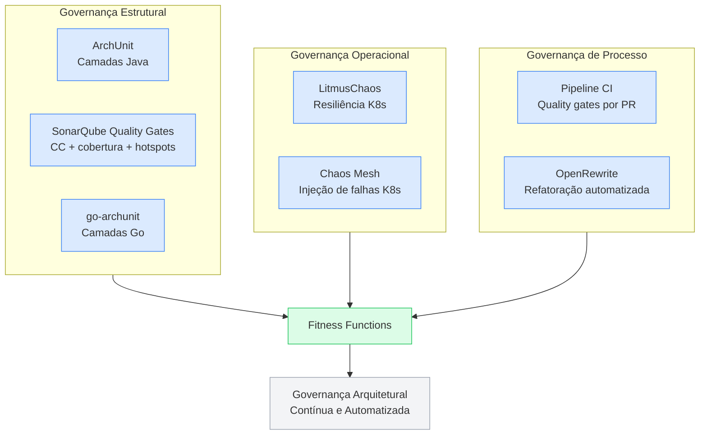
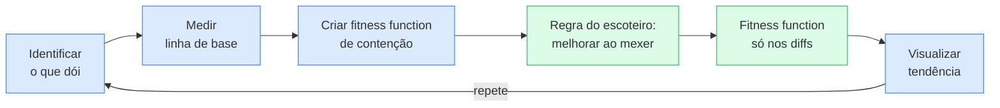

# Fitness Functions

Uma **fitness function** é qualquer mecanismo que fornece uma avaliação objetiva e automatizada da integridade de uma característica arquitetural. Não é um framework novo — é uma **nova perspectiva** sobre ferramentas que você já pode estar usando.

## Definição

> Fitness function = qualquer mecanismo que avalia objetivamente a integridade de uma característica arquitetural.

A sacada é que fitness functions **não são uma tecnologia específica.** São uma lente. Um teste unitário que verifica que `Controller` não importa `Repository` diretamente é uma fitness function. Um monitor que dispara alarme baseado em modelo estatístico de latência é uma fitness function. O Chaos Monkey da Netflix é uma fitness function.

> [!quote] Citação marcante
> "Fitness functions são como checklists automatizados — não é que profissionais sejam incompetentes, mas em trabalhos altamente detalhados e repetitivos, detalhes escapam."

## A metáfora do Checklist Manifesto

O autor compara fitness functions ao *Checklist Manifesto* do Atul Gawande. A ideia:

- **Checklists não existem porque profissionais são ruins** — existem porque o trabalho é complexo demais para a memória humana.
- **Fitness functions codificam princípios arquiteturais importantes** como verificações automatizadas no substrato da arquitetura.
- **A perspectiva correta:** não são mecanismos pesados de controle — são lembretes automatizados do que importa.

## Exemplos concretos



### ArchUnit — camadas arquiteturais em Java

Governa **camadas arquiteturais**: Controller → Service → Persistence. Previne erosão arquitetural — o fenômeno em que a arquitetura lentamente se degrada porque novos desenvolvedores não conhecem (ou não respeitam) as regras de camadas.

```java
// ArchUnit: Controller não pode acessar Repository diretamente
classes().that().resideInAPackage("..controller..")
    .should().onlyAccessClassesThat()
    .resideInAnyPackage("..service..", "..dto..")
    .check(classes);
```

Ativamente mantido, último release em 2024. Padrão de facto para testes de arquitetura em Java.

### go-archunit — camadas arquiteturais em Go

Port do conceito do ArchUnit para Go. Verifica regras de dependência entre pacotes:

```go
// go-archunit: pacotes de handler não podem importar repositórios
archunit.Check(t, func() {
    restriction := archunit.Packages("**/handler/..").
        ShouldNotDependOn("**/repository/..")
    restriction.Assert()
})
```

### SonarQube / SonarCloud — quality gates no CI

Substitui ferramentas como JDepend com uma abordagem multi-linguagem (Java + Go). Roda no CI e bloqueia PRs que violam thresholds:

| Regra | Threshold típico | Fitness function |
|---|---|---|
| Complexidade ciclomática por função | CC < 5 | Previne funções-monstro |
| Cobertura de código no diff | ≥ 80% no novo código | Garante que código novo é testado |
| Duplicação de código | < 3% | Previne copy-paste architecture |
| Security hotspots | 0 critical | Previne vulnerabilidades conhecidas |

> [!tip] Quality gate = fitness function
> Um quality gate do SonarQube é exatamente uma fitness function: avalia objetivamente a integridade de características arquiteturais (modularidade via CC, testabilidade via cobertura, segurança via hotspots) a cada PR.

### LitmusChaos — chaos engineering em Kubernetes

Projeto CNCF para experimentos de caos declarativos no cluster. Substitui o Chaos Monkey da Netflix com uma abordagem Kubernetes-native:

```yaml
# LitmusChaos: injeta latência de rede entre serviços
apiVersion: litmuschaos.io/v1alpha1
kind: ChaosEngine
spec:
  experiments:
    - name: pod-network-latency
      spec:
        components:
          - name: payment-service
            networkLatency: 2000ms
```

### Chaos Mesh — injeção de falhas K8s

Alternativa CNCF ao LitmusChaos. Suporta tipos de falha mais granulares:

| Tipo de experimento | Fitness function |
|---|---|
| **Pod Kill** | Verifica resiliência a crash de pods |
| **Network Delay** | Verifica tolerância a latência entre serviços |
| **IO Fault** | Verifica comportamento com disco lento/indisponível |
| **DNS Fault** | Verifica resiliência a falhas de DNS |

### OpenRewrite — refatoração automatizada

Fitness function que **conserta** em vez de só detectar. Receitas declarativas que transformam código automaticamente:

```yaml
# OpenRewrite: proíbe @Autowired em field injection (substitui por constructor injection)
type: specs.openrewrite.org/v1beta/recipe
name: examples.NoFieldInjection
displayName: Use constructor injection
recipeList:
  - org.openrewrite.java.spring.NoAutowiredOnFields
```

> [!info] Fitness function como código que conserta
> OpenRewrite eleva o conceito: em vez de apenas *detectar* violações (build vermelho), ele *corrige* automaticamente. A fitness function é o PR que o bot abre com a refatoração aplicada.

## Fitness functions não são peso morto

Um erro comum é pensar em fitness functions como um sistema pesado de governança corporativa. A perspectiva do autor é o oposto:

- **São checklists, não guardas de trânsito.** Elas lembram o que importa — não bloqueiam indiscriminadamente.
- **Use ferramentas que você já tem.** Métricas de build, testes unitários, monitores de produção — todos podem ser fitness functions se você os *enxergar* como verificações de integridade arquitetural.
- **Comece pequeno.** Uma fitness function por sprint já faz diferença.

## E quando a base é bagunçada?

> [!question] Pergunta real
> "E quando se fala de uma base que tem a arquitetura bagunçada, e não há tempo hábil no dia a dia para refatorar toda uma arquitetura — como medir e melhorar as características arquiteturais?"

Essa é a situação mais comum no mundo real. A resposta não é "refatore tudo" — é uma abordagem incremental com fitness functions como **guardiãs do progresso**:

### Estratégia incremental

1. **Identifique o que mais dói.** Não tente medir tudo. Qual característica arquitetural está causando mais incidentes, atrasos ou bugs? Comece por ela.

2. **Meça a linha de base.** Antes de melhorar, tire uma foto do estado atual. Ex: "hoje, 40% dos deploys falham" ou "o endpoint X tem latência p95 de 3 segundos."

3. **Crie uma fitness function de contenção.** Não para "consertar tudo", mas para garantir que **não piore.** Exemplo: SonarQube bloqueando *novas* violações de CC > 5 — as existentes ficam, mas ninguém adiciona mais.

4. **Aplique a regra do escoteiro.** Em cada sprint, ao mexer em um módulo para uma feature, melhore uma coisa naquele módulo. Uma extração de classe, uma quebra de dependência, um teste a mais.

5. **Fitness function de gatilho.** Configure a fitness function para disparar apenas nos arquivos alterados no PR (não no código inteiro). Assim ela não bloqueia o time, mas protege o que está sendo modificado.

6. **Visualize a tendência, não o valor absoluto.** Se CC média do projeto é 15, a meta não é "chegar a 5 amanhã." A meta é "a cada mês, a CC média dos arquivos alterados deve ser menor."



> [!tip] Heurística
> "Não deixe piorar" é uma meta muito mais realista que "consertar tudo" — e já inverte a direção da entropia. Com contenção + regra do escoteiro, a arquitetura melhora organicamente ao longo do tempo, sem precisar de um projeto de refatoração de 6 meses.

## Conexões

- [[medicao-caracteristicas-arquiteturais|Medição de Características Arquiteturais]] — as métricas que as fitness functions governam
- [[caracteristicas-arquiteturais|Características Arquiteturais]] — as -ilities que estamos protegendo
- [[identificacao-caracteristicas-arquiteturais|Identificação de Características Arquiteturais]] — como decidir quais -ilities merecem fitness functions
- [[modularidade|Modularidade]] — a modularidade é a característica estrutural mais frequentemente governada por fitness functions
- [[conascencia|Conascência]] — fitness functions detectam e previnem conascência indesejada (ex: dependências cíclicas)

> [!note] Páginas futuras
> **Chaos Engineering** — a prática de injetar falhas controladas em produção para testar resiliência. Criar página quando houver mais fontes (ex: Principles of Chaos Engineering).
> **Erosão Arquitetural** — o fenômeno de degradação gradual da arquitetura ao longo do tempo. O Cap 4 menciona brevemente; merece página própria quando houver mais fontes.

## Fontes

- [[raw/books/fundamentos-eng-software/6 - Medindo e Controlando as Caracteristicas Arquiteturais|Cap 6: Medindo e Controlando as Características Arquiteturais]] — Richards & Ford, O'Reilly
