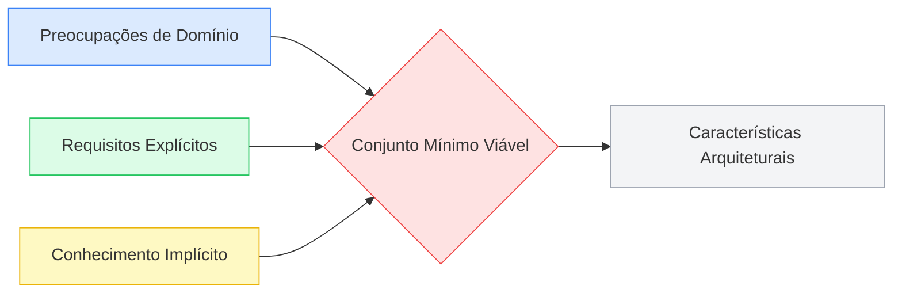
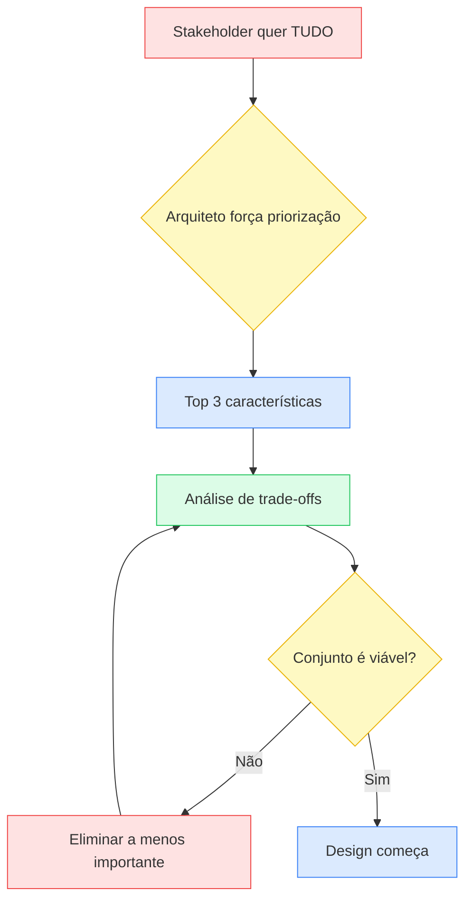

# Identificação de Características Arquiteturais

Identificar características arquiteturais não é sobre consultar um catálogo de "-ilities" e marcar as que "parecem importantes". É um processo de **escuta ativa + tradução técnica**: ouvir stakeholders de negócio, ler requisitos explícitos e — mais difícil — perceber o que não está escrito em lugar nenhum mas todo mundo no domínio sabe. O resultado nunca é uma lista longa; é o **menor conjunto viável** de características que, se negligenciadas, fariam o sistema falhar.

> [!quote] Citação marcante
> "There are no wrong answers in architecture, only expensive ones." — Mark Richards

## As Três Fontes

| Fonte | O que é | Exemplo | Armadilha |
|---|---|---|---|
| **Preocupações de domínio** | O stakeholder fala de negócio, o arquiteto traduz para -ilities | "Time to market" → agilidade + testabilidade + deployability | Traduzir para UMA característica só; quase sempre são múltiplas |
| **Requisitos explícitos** | O que está documentado: metas de escala, restrições, números | "Suportar 100k usuários simultâneos" → escalabilidade + elasticidade | Parar aqui; achar que o documento de requisitos é suficiente |
| **Conhecimento implícito** | O que não está escrito mas todo profissional do domínio sabe | Universitários se inscrevem em massa nos últimos 10 minutos | Exige vivência no domínio — não se aprende lendo documento |

### Preocupações de domínio: a tradução é sempre plural

Uma preocupação de domínio **nunca** mapeia para uma única característica. O capítulo mostra a Tabela 5-1 com esse mapeamento de preocupações de domínio para características arquiteturais:

| Preocupação de domínio | Características arquiteturais |
|---|---|
| Fusões e aquisições | Interoperabilidade, escalabilidade, adaptabilidade, extensibilidade |
| Time to market | Agilidade, testabilidade, deployability |
| Satisfação do usuário | Performance, disponibilidade, tolerância a falhas, testabilidade, deployability, agilidade, segurança |
| Vantagem competitiva | Agilidade, testabilidade, deployability, escalabilidade, disponibilidade, tolerância a falhas |
| Tempo e orçamento | Simplicidade, viabilidade |

O exemplo mais didático do capítulo:

> Stakeholder diz: "Devido a requisitos regulatórios, é imperativo concluir a precificação dos fundos no final do dia a tempo."

Um arquiteto inexperiente ouve "a tempo" e pensa: **performance**. Mas o sistema precisa de muito mais:

- **Disponibilidade** — não importa a velocidade se o sistema está fora do ar
- **Escalabilidade** — conforme mais fundos são criados, o processamento ainda cabe na janela?
- **Confiabilidade** — o sistema não pode travar no meio do cálculo
- **Recuperabilidade** — se travar aos 85%, precisa retomar de onde parou
- **Auditabilidade** — os preços estão sendo calculados *corretamente*?

> [!warning] Armadilha
> Focar em apenas UMA característica porque ela "parece ser o foco principal" da preocupação de domínio é o erro mais comum nessa etapa. É como colocar farinha mas esquecer o fermento — o bolo não cresce.

### Conhecimento implícito: o que ninguém documenta

É a fonte mais negligenciada e, frequentemente, a que causa as falhas mais caras:

> [!example] Exemplo do capítulo
> Um sistema de matrícula universitária para 1.000 alunos, com 10 horas de janela. O arquiteto ingênuo assume distribuição uniforme (~100 alunos/hora). Qualquer pessoa que já pisou numa universidade sabe que **todos os 1.000 vão tentar se matricular nos últimos 10 minutos**. Isso não está em documento de requisito nenhum — e dimensionar para 100/hora quando a realidade é 6.000/hora é catastrófico.

## O Anti-Padrão Vasa

> [!info] Contexto histórico
> O **Vasa** foi um navio de guerra sueco construído entre 1626 e 1628. Afundou na viagem inaugural, a menos de 1.300 metros do porto. Por quê? O rei Gustavo II Adolfo insistiu que o navio fosse ao mesmo tempo navio de transporte E navio de guerra, com dois conveses de canhões pesados — um design instável que nenhum engenheiro naval da época conseguiria fazer flutuar.

A metáfora é direta: **tentar suportar todas as características arquiteturais afunda o projeto**. Cada -ility adicionada aumenta a complexidade do design. Características interagem entre si — melhorar uma frequentemente degrada outra.

A heurística que o capítulo recomenda:

> [!tip] Heurística prática
> Peça aos stakeholders que **escolham as 3 características mais importantes**. Depois, elimine a menos importante da lista. Não é sobre *selecionar* — é sobre **podar**. O objetivo é o menor conjunto viável.

## A Dificuldade Real: Análise de Trade-offs na Identificação

É aqui que o capítulo 5 expõe a parte mais difícil do trabalho do arquiteto — e onde a maioria dos iniciantes (eu inclusa) patina.

Identificar as características é só a primeira metade. A segunda — e mais difícil — é decidir **quais sacrificar**. Porque o orçamento de complexidade é finito: cada característica que você decide suportar tem um custo de design, de implementação e de operação. E elas brigam entre si.

O capítulo é explícito: **não existe "melhor design" em arquitetura — apenas a "menos pior coleção de trade-offs"**. Isso não é derrotismo. É reconhecer que:

1. **Características são interdependentes** — melhorar segurança pode degradar performance; aumentar disponibilidade pode complicar consistência
2. **O contexto decide** — a característica certa para um sistema de matrícula universitária não é a mesma para um sistema de precificação de fundos
3. **Stakeholders não sabem priorizar** — eles querem tudo. Cabe ao arquiteto fazer as perguntas certas para forçar escolhas

> [!warning] Onde eu ainda preciso estudar mais
> A análise de trade-offs entre características arquiteturais — especialmente quando elas interagem de forma não-óbvia — é uma das áreas mais complexas da arquitetura de software. Saber *identificar* é o primeiro passo; saber *escolher e sacrificar* é o que separa arquitetos seniores de juniores. Os capítulos posteriores do livro prometem aprofundar esse tema, e é uma área que ainda está em `understanding: medium` pra mim.

## Exemplo Prático: Silicon Sandwiches Kata

O capítulo percorre um exemplo completo — uma rede de sanduíches querendo delivery online. A partir de cada requisito, deriva as características:

| Requisito | Tradução | Característica(s) |
|---|---|---|
| "Milhares de usuários, talvez milhões" | Escala imprevisível, crescimento rápido | Escalabilidade, elasticidade |
| "Usuários podem personalizar sanduíches" | Cada pedido é único | Customizability |
| "Tempo de resposta rápido" | Experiência do usuário final | Performance |
| "Sistema não pode ficar fora do ar no horário de almoço" | Pico previsível, crítico para receita | Disponibilidade |
| "Pagamentos online" | Dados sensíveis, conformidade | Segurança, confiabilidade |

O exercício mostra como um requisito aparentemente simples ("usuários podem personalizar sanduíches") gera uma característica arquitetural (customizability) que tem impacto estrutural real — não é só uma feature de UI, afeta como o backend modela pedidos, ingredientes e preços.

## Anti-padrões na Identificação

| Anti-padrão | Sintoma | Consequência |
|---|---|---|
| **Arquiteto torre de marfim** | Desenha sozinho e joga o diagrama por cima do muro | Time de implementação rejeita ou distorce a arquitetura |
| **Vasa (suportar tudo)** | Lista de características cresce sem poda | Sistema genérico, pesado, que não faz nada bem |
| **Parar nos requisitos explícitos** | Lê o documento de requisitos e acha que acabou | Perde conhecimento implícito crítico do domínio |
| **Tradução 1:1** | Cada preocupação de domínio vira UMA característica | Sistema frágil que falha em cenários reais |

> [!tip] Dica prática
> Colabore com o time de implementação **durante** a identificação, não depois. Eles conhecem detalhes técnicos que afetam a viabilidade das características. O capítulo insiste: arquitetura não se faz sozinho.

## Conexões

- [[caracteristicas-arquiteturais|Características Arquiteturais]] — o capítulo 4 define *o que são*; este capítulo 5 ensina *como identificá-las*
- [[medicao-caracteristicas-arquiteturais|Medição de Características Arquiteturais]] — como medir as -ilities com métricas objetivas (Cap 6 — passo seguinte)
- [[fitness-functions|Fitness Functions]] — governança automatizada das características arquiteturais (Cap 6)
- [[arquitetura-de-software|Arquitetura de Software]] — características arquiteturais são uma das 4 dimensões, e a 1ª Lei (tudo é trade-off) é o fundamento por trás da poda
- `assistant/domain/competencies.md` — cobre `architecture`, `product-acumen`, `domain-knowledge`, `technical-communication` e `problem-decomposition`

> [!note] Páginas futuras
> **Análise de trade-offs arquiteturais** — o capítulo 5 introduz o conceito de que não existe "melhor design", apenas a "menos pior coleção de trade-offs". Os capítulos posteriores devem desenvolver isso com mais profundidade. Criar página dedicada quando houver fontes suficientes.
> **Architecture Decision Records (ADRs)** — a insistência do capítulo em colaboração com o time e em documentar o *porquê* das escolhas converge naturalmente para ADRs. Criar quando aparecer em fontes específicas.

## Fontes

- [[raw/books/fundamentos-eng-software/sources/cap-05.source|Cap 5 — texto original (EN)]]
