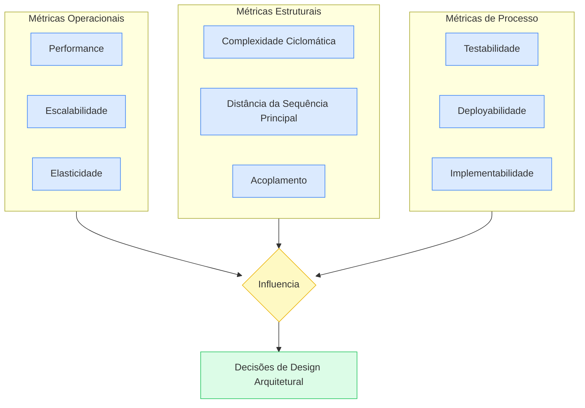

# Medição de Características Arquiteturais

Depois de identificar as características arquiteturais ([[identificacao-caracteristicas-arquiteturais|Identificação de Características Arquiteturais]]), a pergunta seguinte é inevitável: **como saber se estamos realmente entregando essas características?** Não basta listar "-ilities" — é preciso medi-las com definições objetivas.

## Definição

Medir características arquiteturais significa traduzir atributos abstratos (agilidade, escalabilidade, testabilidade) em métricas quantificáveis e compartilhadas por toda a organização. O objetivo é criar uma **linguagem ubíqua de arquitetura** — definições que um desenvolvedor, um arquiteto e uma pessoa de operações interpretem da mesma forma.

> [!quote] Citação relevante
> "Características não são física — 'agilidade' ou 'deployabilidade' têm significados vagos. Definições variam até dentro da mesma empresa. A solução são definições objetivas em toda a organização."

## Por que medir?

Três problemas comuns que tornam a medição necessária:

| Problema                          | Exemplo                                                                                                          |
| --------------------------------- | ---------------------------------------------------------------------------------------------------------------- |
| **Características são abstratas** | "Agilidade" ou "deployabilidade" não têm existência física — cada pessoa imagina algo diferente                  |
| **Definições variam entre times** | Desenvolvedores, arquitetos e operações discordam sobre o que "escalável" significa                              |
| **Características são compostas** | Agilidade se decompõe em modularidade + deployabilidade + testabilidade — medir o composto exige medir as partes |

## As três categorias de métricas

O capítulo organiza as métricas em três categorias, dependendo do *que* está sendo medido:

### 1. Métricas Operacionais

Medem o comportamento do sistema em produção: **performance, escalabilidade, elasticidade.**

> [!tip] Boa prática
> Times maduros não usam thresholds arbitrários ("alarme em 80% de CPU"). Usam **análise estatística**: alarmes disparam quando métricas em tempo real saem dos modelos de predição gerados a partir de dados históricos.

**Performance budgets** para web:
- First Contentful Paint — tempo até o primeiro conteúdo visível
- First CPU Idle — tempo até a página ficar interativa
- K-weight budgets — limite de kilobytes para recursos críticos

### 2. Métricas Estruturais

Medem a qualidade interna do código. A principal é a **complexidade ciclomática**:

**Fórmula:** `CC = E − N + 2P`
- E = número de arestas no grafo de fluxo
- N = número de nós
- P = número de componentes conexos (normalmente 1)

Na prática: CC conta o número de caminhos independentes no código. Cada `if`, `for`, `while`, `case` adiciona +1.

| Limiar | Interpretação |
|---|---|
| 1–5 | Código simples, baixo risco |
| 6–10 | Complexidade moderada |
| 11–20 | Complexidade alta, risco |
| 21–50 | Muito complexo, alto risco |
| 50+ | Intestável |

> [!warning] Armadilha
> A indústria costuma recomendar CC < 10, mas o autor defende CC < 5. É um limiar mais restritivo — e mais realista para código bem testado. O caso extremo citado: uma função C com CC > 800 e 4000+ linhas.

> [!tip] TDD e complexidade
> TDD tem o efeito colateral positivo de reduzir CC naturalmente: você escreve o teste primeiro, o que força funções menores e mais focadas.

### 3. Métricas de Processo

Medem **como o time desenvolve**, não apenas o código. Exemplos:

| Métrica | O que mede |
|---|---|
| Cobertura de testes | % de código coberto por testes |
| % de deploys bem-sucedidos | Proporção de deploys que não geraram rollback |
| Duração do deploy | Quanto tempo leva para colocar código em produção |
| Bugs por deploy | Quantos incidentes cada deploy introduz |
| % de implementações corretas de primeira | Funcionalidades entregues sem retrabalho |

> [!warning] Cobertura não garante qualidade
> 100% de cobertura com `Assert.True(true)` não protege nada. Cobertura é uma métrica objetiva, mas sozinha não garante qualidade — precisa vir acompanhada de bons testes.

## O ciclo: processo → arquitetura

A ideia mais poderosa do capítulo: **métricas de processo influenciam decisões estruturais.**

Se deployabilidade é prioridade → a arquitetura precisa ser mais modular.
Se testabilidade é prioridade → módulos precisam ser desacoplados.

**Exemplo concreto:** se o time mede que cada feature nova demora 3 dias porque precisa alterar 15 arquivos em 5 módulos, isso sinaliza que a modularidade está ruim. A decisão arquitetural de separar melhor os módulos é *motivada pela métrica de processo*.

## Implicações práticas

1. **Comece pelo que dói.** Se deploys falham com frequência, meça deployabilidade primeiro. Se o sistema fica lento, comece com métricas operacionais.
2. **Defina a métrica ANTES de definir a meta.** "Quero 99% de deploys bem-sucedidos" só faz sentido depois que você sabe qual é o número atual.
3. **Métricas de processo são mais baratas de medir** que métricas estruturais — comece por elas.

## Conexões

- [[fitness-functions|Fitness Functions]] — a outra metade do capítulo: como governar essas métricas com verificações automatizadas
- [[caracteristicas-arquiteturais|Características Arquiteturais]] — as -ilities que estamos medindo
- [[identificacao-caracteristicas-arquiteturais|Identificação de Características Arquiteturais]] — como identificar quais -ilities importam
- [[modularidade|Modularidade]] — a modularidade é pré-condição para testabilidade e deployabilidade
- [[arquitetura-de-software|Arquitetura de Software]] — definição fundamental de arquitetura

> [!note] Páginas futuras
> **Performance Budgets** — orçamentos de performance para web (FCP, TTI, K-weight). Criar página quando houver fontes específicas sobre web performance.
> **Complexidade Ciclomática** — a métrica merece página própria com mais exemplos de cálculo e ferramentas (SonarQube, Radon para Python).

## Fontes

- [[raw/books/fundamentos-eng-software/6 - Medindo e Controlando as Caracteristicas Arquiteturais|Cap 6: Medindo e Controlando as Características Arquiteturais]] — Richards & Ford, O'Reilly
