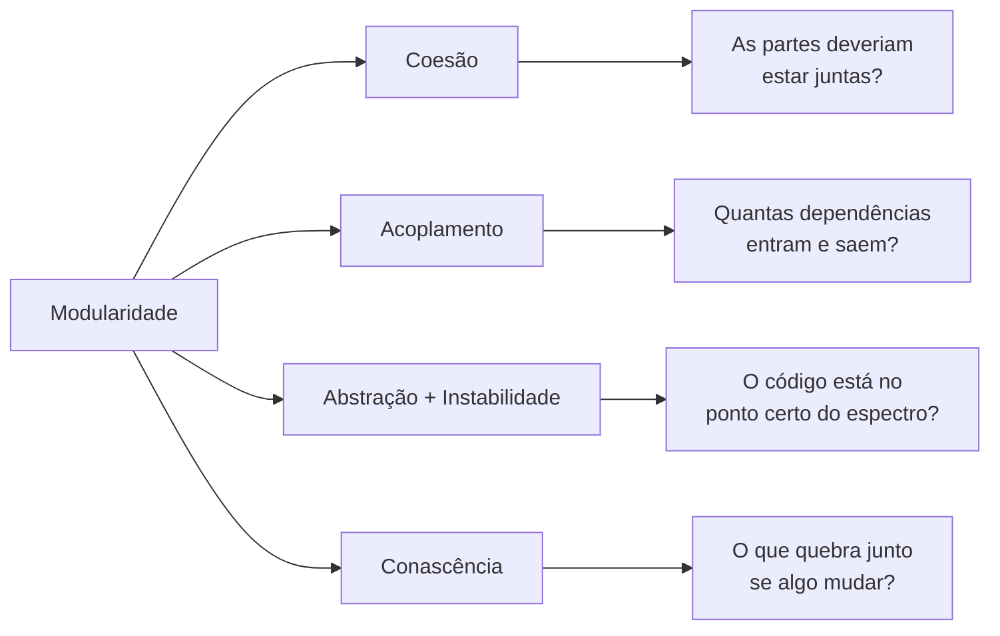
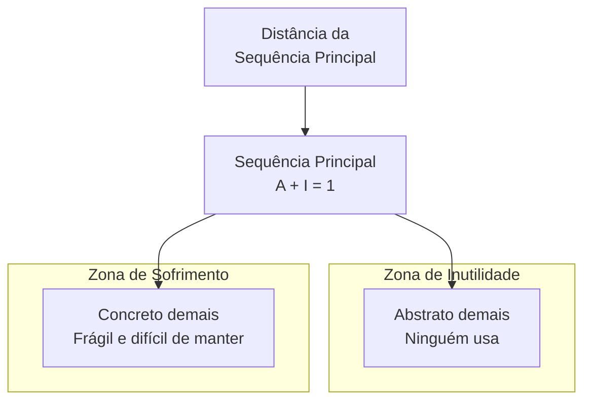

# Modularidade

Modularidade é agrupar código relacionado em unidades lógicas — classes, funções, pacotes, o que for. O termo descreve **separação lógica**, não física. Dois módulos podem estar no mesmo deploy e ainda assim serem módulos distintos.

> [!info] Por que isso importa?
> "Se um arquiteto planeja um sistema sem prestar atenção em como as peças se conectam, acaba criando um sistema com muitas dificuldades." — o capítulo abre com essa ideia. Modularidade não é cosmética: é o que determina se o sistema evolui ou se quebra a cada mudança.

## As 4 ferramentas de medição

O capítulo apresenta quatro lentes para avaliar modularidade. Nenhuma é "a certa" — elas se complementam:



---

## Coesão

Coesão mede o quanto as partes de um módulo **merecem** ficar juntas. Um módulo é coeso se dividi-lo em partes menores exigiria acoplar essas partes via chamadas entre módulos para produzir resultados úteis.

A coesão é menos precisa que o acoplamento — a literatura lista sete variantes, mas na prática o grau de coesão é uma **decisão do arquiteto**, não um número absoluto.

### O dilema na prática

Usando o exemplo do livro:

> [!example] Cenário A: Módulo único
> **Customer Maintenance**
> - `add customer` / `update customer` / `get customer` / `notify customer`
> - `get customer orders` / `cancel customer orders`

> [!example] Cenário B: Módulos separados
> **Customer Maintenance**: `add` / `update` / `get` / `notify`
> **Order Maintenance**: `get customer orders` / `cancel customer orders`

Qual é a estrutura correta? **Depende.** As perguntas que decidem:

| Pergunta                                                                                      | Se a resposta for "sim"                      | Se a resposta for "não"   |
| --------------------------------------------------------------------------------------------- | -------------------------------------------- | ------------------------- |
| `Order Maintenance` só teria essas 2 operações?                                               | Juntar em `Customer Maintenance` (Cenário A) | Separar (Cenário B)       |
| `Customer Maintenance` vai crescer muito no futuro?                                           | Separar já (Cenário B)                       | Manter junto por enquanto |
| `Order Maintenance` precisa de tantos dados de Customer que separar criaria alto acoplamento? | Manter junto (Cenário A)                     | Separar (Cenário B)       |

> [!tip] Isso é análise de trade-off
> Essas três perguntas **são** o trabalho do arquiteto. Não é sobre saber a resposta certa — é sobre saber **quais perguntas fazer**.

---

## Acoplamento

Acoplamento mede as conexões entre artefatos de código (classes, componentes, funções). Existem duas direções:

| Tipo | Direção | Metáfora | Exemplo |
|---|---|---|---|
| **Aferente** | Conexões que **chegam** | "Quantos me chamam?" | `PedidoService` é chamado por 5 controllers, 3 jobs e 2 listeners |
| **Eferente** | Conexões que **saem** | "Quantos eu chamo?" | `PedidoService` chama `PedidoRepository`, `EstoqueClient`, `NotificacaoClient`, `FaturamentoClient` |

> [!warning] Cuidado com o eferente alto
> Uma classe com alto acoplamento eferente é frágil: se qualquer um dos métodos que ela chama mudar, ela pode quebrar. Um serviço que depende de 15 clients REST diferentes é um risco concentrado — cada um desses clients pode mudar seu contrato.

### Exemplo prático

```java
// ALTO acoplamento eferente — esta classe depende de 4 coisas externas
class PedidoService {
    private PedidoRepository repo;       // dependência 1
    private EstoqueClient estoque;       // dependência 2
    private NotificacaoClient notif;     // dependência 3
    private FaturamentoClient fat;       // dependência 4

    void cancelar(Pedido p) {
        repo.save(p.cancelar());
        estoque.liberar(p.getItens());
        fat.estornar(p.getCobranca());
        notif.avisar(p.getCliente());
    }
}
```

O método `cancelar` mexe com 4 dependências externas. Se `FaturamentoClient` mudar o contrato de `estornar`, `PedidoService` quebra — mesmo sem ter mudado uma linha da sua lógica de cancelamento.

---

## Abstração, Instabilidade e Distância da Sequência Principal

Esses três conceitos formam um modelo para avaliar se um componente está equilibrado.

### Abstração (A)

Proporção de artefatos abstratos (interfaces, classes abstratas) para artefatos concretos (implementações).

```
A = nº de artefatos abstratos / nº total de artefatos
```

Se um pacote tem 2 interfaces e 8 classes concretas → A = 0.2. Se tem 8 interfaces e 2 classes → A = 0.8.

### Instabilidade (I)

Proporção do acoplamento eferente sobre o acoplamento total. Mede a **volatilidade** — quanto mais instável, mais fácil o componente quebra quando algo externo muda.

```
I = acoplamento eferente / (acoplamento eferente + acoplamento aferente)
```

- **I = 0**: o componente não depende de ninguém (só recebe chamadas). Estável, mas pode ser rígido demais.
- **I = 1**: o componente depende de todo mundo (só faz chamadas). Instável, quebra com facilidade.

### Distância da Sequência Principal (D)

Combina abstração e instabilidade em um gráfico:



A **sequência principal** é a reta onde A + I = 1. O ideal é estar o mais próximo possível dessa reta:

| Posição | A | I | Significado |
|---|---|---|---|
| Na sequência principal | 0.5 | 0.5 | Equilíbrio: metade abstração, metade estabilidade |
| Zona de sofrimento | 0.1 | 0.9 | Muita dependência externa, zero abstração. Quebra fácil. |
| Zona de inutilidade | 0.9 | 0.1 | Muita abstração, ninguém depende. Código que ninguém usa. |

> [!info] Tem uso diário?
> Ninguém calcula A e I na mão diariamente. Mas o **modelo mental** é útil: quando você sente que uma classe é "frágil demais" ou "abstrata demais", esse modelo dá nome ao problema. Ferramentas como SonarQube e NDepend calculam essas métricas automaticamente.

---

## Como as 4 ferramentas se conectam

| Ferramenta                | Pergunta central            | Melhor para                                    |
| ------------------------- | --------------------------- | ---------------------------------------------- |
| Coesão                    | "Isso deveria estar junto?" | Decidir onde colocar código novo               |
| Acoplamento               | "Quantas dependências?"     | Identificar riscos de mudança                  |
| Abstração + Instabilidade | "Está equilibrado?"         | Avaliar saúde de componentes existentes        |
| Conascência               | "O que quebra junto?"       | Refinamento — ver [[conascencia\|Conascência]] |

A progressão natural é: use **coesão e acoplamento** para decisões táticas do dia a dia, **abstração/instabilidade** para avaliar a saúde de pacotes e componentes, e **conascência** para refinar acoplamentos complexos (especialmente entre serviços).

---

## O que levar para o dia a dia

1. **Modularidade não é binária** — não existe "modular" vs "não modular". Existem **graus** e você mede com essas ferramentas.
2. **Toda decisão de modularização é um trade-off** — juntar reduz acoplamento entre módulos mas reduz coesão. Separar aumenta coesão mas cria acoplamento. A pergunta certa é: "qual dor eu prefiro?"
3. **Acoplamento eferente é risco** — conte as dependências que saem da sua classe. Se passar de 4-5, pergunte se ela não está fazendo coisa demais.
4. **A zona de sofrimento é real** — classes concretas que todo mundo chama e que chamam todo mundo são as que mais quebram em produção.

## Conexões

- [[arquitetura-de-software|Arquitetura de Software]] — a 1ª lei (tudo é trade-off) é o fundamento por trás das decisões de modularização.
- [[conascencia|Conascência]] — a ferramenta mais refinada para medir acoplamento.
- [[medicao-caracteristicas-arquiteturais|Medição de Características Arquiteturais]] — modularidade é uma métrica estrutural chave; complexidade ciclomática mede a saúde da modularização
- [[acompanhamento-competencias|Mapa de Estudos]]

> [!note] Páginas futuras
> **Trade-off arquitetural** — a análise de trade-off aparece como tema central aqui. Criar página dedicada quando houver mais material (ex: Cap 4 em diante).
